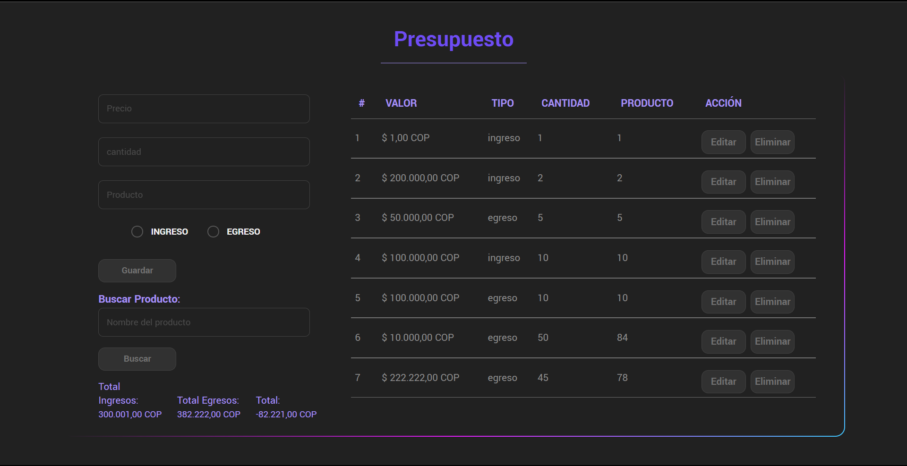
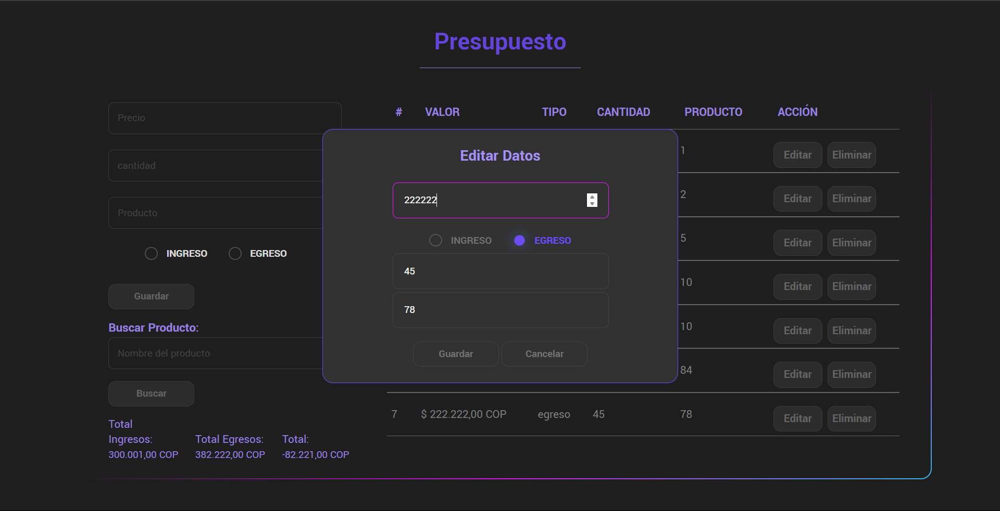

# Sistema de Gestión de Ingresos y Egresos

Este repositorio contiene el código fuente de un sistema simple de gestión de ingresos y egresos. El sistema utiliza HTML, CSS y JavaScript para crear una interfaz de usuario que permite al usuario agregar, editar y eliminar transacciones de ingresos y egresos. También proporciona la capacidad de buscar transacciones por nombre de producto.

## Indice
* [Contenido del repositorio](#contenido-del-repositorio)
* [Configuración del Proecto](#configuración-del-proyecto)
* [Uso del sistema](#uso-del-sistema)
* [Requisitos](#requisitos)
* [Funcionalidades](#funcionalidades)

## Contenido del Repositorio

- **index.html**: Este archivo HTML define la estructura de la página web y contiene los formularios y la tabla para ingresar y visualizar los datos del presupuesto.

- **style.css**: El archivo CSS proporciona estilos para la interfaz de usuario del sistema de gestión de presupuesto, incluyendo el diseño y la apariencia de los elementos HTML.

- **main.js**: Este archivo JavaScript contiene la lógica de la aplicación, incluyendo la manipulación de datos, la interacción con el servidor y las funciones de agregar, editar y eliminar transacciones.

- **db.json**: Este archivo JSON se utiliza como una base de datos simulada para almacenar y recuperar datos de transacciones de ingresos y egresos.

- **.gitignore**: El archivo `.gitignore` se asegura de que ciertos archivos y directorios, como `node_modules` y `package-lock.json`, no se incluyan en el repositorio de Git.

## Configuración del Proyecto

No se requiere una instalación especial para ejecutar este sistema, ya que se puede abrir en cualquier navegador web. Simplemente siga estos pasos:

1. Clone este repositorio en su máquina local:

        git clone https://github.com/RCNicolas/Presupuesto.git

2. Navegue hasta la carpeta del repositorio:

        cd Presupuesto

3. Abra el archivo `index.html` en su navegador web.
El proyecto incluye un archivo `package.json` que define las dependencias necesarias para ejecutar el servidor JSON simulado utilizado para almacenar datos. Asegúrese de tener Node.js instalado y luego ejecute en el terminal el siguiente comando para instalar las dependencias:

        npm -E -D install json-server

4. Asegurate de tener la siguinete linea de codigo en el `scripts` del archivo `package.json` para ejecutar el siguiente comando de manera efectiva y poder lanzar el servidor local 

        "dev": "json-server --watch db.json --port 5004 --host 127.0.0.2"
5. Luego, puede iniciar el servidor JSON simulado ejecutando:

        npm run dev

Esto iniciará el servidor en `http://127.0.0.2:5004/presupestos`, donde se almacenarán y recuperarán los datos del presupuesto.

## Uso del Sistema

1. Abra el archivo `index.html` en un navegador web.

2. En la parte superior de la página, encontrará un formulario para agregar nuevos datos al presupuesto. Complete los campos requeridos, incluyendo el valor, la cantidad, el producto y seleccione si es un ingreso o un egreso. Haga clic en el botón "Guardar" para agregar la transacción al presupuesto.

3. Puede buscar transacciones existentes por nombre de producto utilizando el campo de búsqueda y haciendo clic en el botón "Buscar".

4. En la tabla debajo del formulario de búsqueda, verá una lista de transacciones existentes con detalles como el valor, el tipo (ingreso o egreso), la cantidad y el producto. Puede editar o eliminar cada transacción utilizando los botones correspondientes.

5. Para editar una transacción, haga clic en el botón "Editar" correspondiente a la transacción que desea modificar. Se abrirá un diálogo que le permitirá realizar cambios en la transacción. Después de realizar las ediciones necesarias, haga clic en el botón "Guardar" dentro del diálogo para guardar los cambios.

6. Para eliminar una transacción, haga clic en el botón "Eliminar" correspondiente a la transacción que desea eliminar. La transacción se eliminará de la lista.

## Requisitos

Para ejecutar este sistema de gestión de ingresos y egresos, necesitará:

* Un navegador web moderno (por ejemplo, Google Chrome, Mozilla Firefox).
* Conexión a Internet para cargar las dependencias externas.

## Funcionalidades

Este sistema de gestión de ingresos y egresos incluye las siguientes funcionalidades:

* Agregar, editar y eliminar transacciones.
* Filtrar transacciones por nombre de producto.
* Mostrar una lista de transacciones en una tabla.
* Gestión de transacciones utilizando una API local con Json-server

---

[**Nicolas Ruiz**](https://github.com/RCNicolas)

